# 🦢 APort in Goose: Architecture Guide

> **Policy enforcement for Goose agents running MCP tools**
> **Compliant with [Open Agent Passport (OAP) v1.0](https://github.com/aporthq/aport-spec)**

This document explains how APort integrates with [Goose](https://github.com/block/goose) to add policy-based guardrails for AI agent actions.

---

## 📋 Table of Contents

- [The Gap: Goose Without Policy Enforcement](#the-gap-goose-without-policy-enforcement)
- [The Solution: Goose + APort Extension](#the-solution-goose--aport-extension)
- [Integration Architecture](#integration-architecture)
- [Real-World Flow: GitHub PR Creation](#real-world-flow-github-pr-creation)
- [Real-World Flow: Data Export](#real-world-flow-data-export)
- [Implementation Details](#implementation-details)
- [Performance & Security](#performance--security)

---

## The Gap: Goose Without Policy Enforcement

**Goose today has 3-tier tool permissions:**
- ✅ Always Allow
- ⚠️ Ask Before
- ❌ Never Allow

**The problem:** These are binary. You can't express business logic like:
- ✅ "Allow PRs up to 500KB in size"
- ✅ "Max 10 PRs per day"
- ✅ "Only merge to feature/* branches, never main"
- ✅ "Require path allowlist for sensitive files"

```mermaid

graph TB
    subgraph "Goose Agent (Current State)"
        A[👤 User: Create PR with 1000 files]
        A --> B[🦢 Goose Agent]
        B --> C{Tool Permission?}
        C -->|Always Allow| D[✅ Allowed]
        C -->|Ask Before| E[❓ Prompt User]
        C -->|Never Allow| F[❌ Blocked]
        E --> G{User Approves?}
        G -->|Yes| D
        G -->|No| F
        D --> H[🐙 GitHub MCP Server]
        H --> I[📝 1000-file PR Created]
    end

    subgraph "❌ The Problem"
        J[No Size Limit Check]
        K[No Daily PR Cap Enforcement]
        L[No Audit Trail]
        M[No Global Suspend]
    end

    I -.->|Missing| J
    I -.->|Missing| K
    I -.->|Missing| L
    I -.->|Missing| M

    style A stroke:#0284c7,stroke-width:2px
    style B stroke:#0284c7,stroke-width:2px
    style D stroke:#059669,stroke-width:2px
    style F stroke:#dc2626,stroke-width:2px
    style H stroke:#7c3aed,stroke-width:2px
    style I stroke:#d97706,stroke-width:2px
    style J stroke:#ef4444,stroke-width:2px
    style K stroke:#ef4444,stroke-width:2px
    style L stroke:#ef4444,stroke-width:2px
    style M stroke:#ef4444,stroke-width:2px
```



---

## The Solution: Goose + APort Extension

**APort adds graduated controls:**
- ✅ Business logic enforcement (size limits, daily caps, branch restrictions)
- ✅ Identity verification (agent passport required per OAP v1.0)
- ✅ Cryptographic audit trails (Ed25519 signed receipts)
- ✅ Global suspend capability (<15 seconds propagation)

```mermaid

graph TB
    subgraph main["Goose Agent + APort Extension"]
        A[👤 User: Create large PR]
        A --> B[🦢 Goose Agent<br/>+ APort Extension]
        B --> C{Tool Permission?<br/>Goose Layer}
        C -->|Allowed| D[🛡️ APort Policy Check]
        D --> E{Policy Evaluation}
        E -->|Check 1| F[✅ Passport Active?]
        E -->|Check 2| G[✅ PR Size ≤ 500KB?]
        E -->|Check 3| H[✅ Daily PR cap OK?]
        E -->|Check 4| I[✅ Branch allowed?]

        F & G & H & I --> J{All Checks Pass?}
        J -->|✅ Yes| K[✅ Allow + Sign Receipt]
        J -->|❌ No| L[🚫 Deny + Log Reason]

        K --> M[🐙 GitHub MCP Server]
        M --> N[📝 PR Created<br/>Large PR blocked!]

        L --> O[📋 Audit Trail:<br/>Denied oversized PR<br/>Reason: 1.2MB exceeds limit]
    end

    N --> benefits
    O --> benefits

    subgraph benefits["✅ What APort Adds"]
        P[📊 Business Logic]
        Q[🔐 Identity Verification]
        R[📝 Audit Trail]
        S[⚡ Global Suspend]
    end

    style A stroke:#0284c7,stroke-width:2px
    style B stroke:#0284c7,stroke-width:2px
    style D stroke:#0891b2,stroke-width:3px
    style E stroke:#7c3aed,stroke-width:2px
    style F stroke:#10b981,stroke-width:1px
    style G stroke:#10b981,stroke-width:1px
    style H stroke:#10b981,stroke-width:1px
    style I stroke:#10b981,stroke-width:1px
    style K stroke:#059669,stroke-width:2px
    style L stroke:#dc2626,stroke-width:2px
    style M stroke:#7c3aed,stroke-width:2px
    style N stroke:#059669,stroke-width:2px
    style O stroke:#d97706,stroke-width:2px
    style P stroke:#10b981,stroke-width:2px
    style Q stroke:#10b981,stroke-width:2px
    style R stroke:#10b981,stroke-width:2px
    style S stroke:#10b981,stroke-width:2px
```



---

## Integration Architecture

**How APort integrates with Goose as a Rust extension:**

```mermaid

graph LR
    subgraph "User's Machine"
        subgraph "Goose Agent Runtime"
            A[🦢 Goose Core]
            B[🛡️ APort Extension<br/>Rust Implementation]
            C[Extension Trait:<br/>call_tool]

            A <--> B
            B --> C
        end

        subgraph "MCP Tool Providers"
            D[🐙 GitHub MCP]
            E[📊 Database MCP]
            F[🔧 Filesystem MCP]
            G[💬 Slack MCP]
        end

        C -->|If Allowed| D
        C -->|If Allowed| E
        C -->|If Allowed| F
        C -->|If Allowed| G
    end

    subgraph "APort Cloud (Optional)"
        H[📡 Policy Verification API<br/>/api/verify/policy/pack_id]
        I[🗄️ Policy Packs<br/>code.*, data.*, messaging.*]
        J[📊 Registry<br/>Agent Status Lookups]
        K[📝 Audit Storage<br/>Immutable Logs]

        H --> I
        H --> J
        H --> K
    end

    B -->|HTTPS POST<br/>passport_id + context| H
    H -->|OAP Decision + Signature<br/>~100ms| B

    style A stroke:#0284c7,stroke-width:2px
    style B stroke:#0891b2,stroke-width:3px
    style C stroke:#7c3aed,stroke-width:2px
    style D stroke:#7c3aed,stroke-width:1px
    style E stroke:#7c3aed,stroke-width:1px
    style F stroke:#7c3aed,stroke-width:1px
    style G stroke:#7c3aed,stroke-width:1px
    style H stroke:#059669,stroke-width:2px
    style I stroke:#10b981,stroke-width:1px
    style J stroke:#10b981,stroke-width:1px
    style K stroke:#10b981,stroke-width:1px
```



**Key Components:**

| Component | Purpose | Location |
|-----------|---------|----------|
| **Goose Core** | Agent runtime + LLM orchestration | User's machine |
| **APort Extension** | Policy enforcement via Extension trait | User's machine (Rust) |
| **MCP Servers** | Tool providers (GitHub, databases, etc.) | User's machine or remote |
| **APort API** | Policy verification service | Cloud (api.aport.io) |
| **Policy Packs** | Pre-defined OAP v1.0 rules | Cloud |
| **Registry** | Agent status + passport verification | Cloud |

---

## Real-World Flow: GitHub PR Creation

**Step-by-step: User creates PR, APort checks policy, GitHub creates if allowed**

```mermaid

sequenceDiagram
    autonumber
    participant User
    participant Goose as 🦢 Goose Agent
    participant APort as 🛡️ APort Extension
    participant API as 📡 APort API
    participant GitHub as 🐙 GitHub MCP

    User->>Goose: "Create PR for feature/auth-refactor"
    activate Goose

    Note over Goose: Goose plans action:<br/>Call github.create_pr tool

    Goose->>APort: call_tool("github.create_pr", params)
    activate APort
    Note right of Goose: repo: block/goose<br/>branch: feature/auth-refactor<br/>base: main<br/>files_changed: 45

    Note over APort: Map tool → policy pack:<br/>github.create_pr → code.repository.merge.v1

    APort->>API: POST /verify/code.repository.merge.v1
    activate API
    Note right of API: Request:<br/>passport_id, context<br/>(repo, action, branch, files)

    Note over API: Policy Evaluation (OAP v1.0):<br/>1. Passport active? ✅<br/>2. Assurance ≥ L2? ✅<br/>3. Files ≤ 500? ✅<br/>4. Daily PRs < 10? ✅<br/>5. Branch allowed? ✅

    API-->>APort: Decision: ALLOW<br/>+ signature + receipt
    Note right of APort: decision_id, policy_id<br/>signature (ed25519)<br/>kid: oap:registry:key-2025-01
    deactivate API

    Note over APort: Cache decision (10min TTL)<br/>Store receipt for audit

    APort-->>Goose: PolicyDecision::Allow + Receipt
    deactivate APort

    Goose->>GitHub: Execute github.create_pr()
    activate GitHub
    Note right of Goose: repo: block/goose<br/>branch: feature/auth<br/>files: 45

    GitHub-->>Goose: Success + PR details
    Note right of GitHub: pr_number: 1234<br/>url: github.com/block/<br/>goose/pull/1234
    deactivate GitHub

    Goose-->>User: ✅ PR created successfully<br/>PR #1234<br/>APort Receipt: 550e8400-...
    deactivate Goose

    Note over User,GitHub: 🎯 Total latency: ~600ms (MVP)<br/>• APort policy check: ~500ms<br/>• GitHub API call: ~100ms<br/>Target: <300ms with Q1 optimizations
```



**What happens if policy denies?**


---

## Real-World Flow: Payment Refund (Block/Square Use Case)

**Step-by-step: Support agent processes refund, APort checks amount limits and reason codes**

```mermaid

sequenceDiagram
    autonumber
    participant User
    participant Goose as 🦢 Goose Agent
    participant APort as 🛡️ APort Extension
    participant API as 📡 APort API
    participant Square as 💳 Square MCP

    User->>Goose: "Refund $45 for order ord_abc123"
    activate Goose

    Note over Goose: Goose plans action:<br/>Call square.refund tool

    Goose->>APort: call_tool("square.refund", params)
    activate APort
    Note right of Goose: amount: 4500 ($45)<br/>currency: USD<br/>order_id: ord_abc123<br/>customer_id: cus_xyz<br/>reason_code: customer_request

    Note over APort: Map tool → policy pack:<br/>square.refund → finance.payment.refund.v1

    APort->>API: POST /verify/finance.payment.refund.v1
    activate API
    Note right of API: Request:<br/>passport_id, context<br/>(amount: 4500 cents, currency: USD,<br/>order_id, reason_code)

    Note over API: Policy Evaluation (OAP v1.0):<br/>1. Passport active? ✅<br/>2. Assurance ≥ L2? ✅<br/>3. Amount ≤ $100 max? ✅<br/>4. Daily cap OK? ✅<br/>5. Reason code valid? ✅<br/>6. Region allowed? ✅

    API-->>APort: Decision: ALLOW<br/>+ signature + receipt
    Note right of APort: decision_id: 770fa600-...<br/>signature (ed25519)<br/>remaining daily cap: $455

    deactivate API

    APort-->>Goose: PolicyDecision::Allow + Receipt
    deactivate APort

    Goose->>Square: Execute square.refund()
    activate Square
    Note right of Goose: amount: 4500<br/>order_id: ord_abc123<br/>reason: customer_request

    Square-->>Goose: Success + refund_id
    Note right of Square: refund_id: rf_789xyz<br/>refunded_amount: 4500
    deactivate Square

    Goose-->>User: ✅ Refund processed<br/>$45.00 refunded to order ord_abc123<br/>APort Receipt: 770fa600-...
    deactivate Goose

    Note over User,Square: 🎯 Block/Square use case:<br/>Support agents can process refunds<br/>within limits without manager approval
```



**What makes this valuable for Block/Square:**
- ✅ Support agents can refund up to $100 per transaction
- ✅ Daily caps prevent abuse (e.g., max $500/day)
- ✅ Reason codes required for compliance
- ✅ Cryptographic audit trail for every refund
- ✅ Cross-currency refunds blocked (prevents exchange rate abuse)
- ✅ Idempotency keys prevent duplicate refunds

---

## Real-World Flow: Crypto Trading (Block/TBD Use Case)

**Step-by-step: Trading agent executes BTC purchase, APort checks exchange allowlist and trade limits**

```mermaid

sequenceDiagram
    autonumber
    participant User
    participant Goose as 🦢 Goose Agent
    participant APort as 🛡️ APort Extension
    participant API as 📡 APort API
    participant Exchange as ₿ Coinbase MCP

    User->>Goose: "Buy $500 worth of BTC"
    activate Goose

    Note over Goose: Goose plans action:<br/>Call coinbase.trade tool

    Goose->>APort: call_tool("coinbase.trade", params)
    activate APort
    Note right of Goose: pair: BTC-USD<br/>side: buy<br/>amount_usd: 50000 ($500)<br/>exchange_id: coinbase<br/>wallet_type: hot

    Note over APort: Map tool → policy pack:<br/>coinbase.trade → finance.crypto.trade.v1

    APort->>API: POST /verify/finance.crypto.trade.v1
    activate API
    Note right of API: Request:<br/>passport_id, context<br/>(exchange: coinbase, pair: BTC-USD,<br/>side: buy, amount: $500)

    Note over API: Policy Evaluation (OAP v1.0):<br/>1. Passport active? ✅<br/>2. Assurance ≥ L3? ✅<br/>3. Exchange allowlisted? ✅<br/>4. Trading pair allowed? ✅<br/>5. Amount ≤ $1,000 max? ✅<br/>6. Daily volume OK? ✅<br/>7. Hot wallet limit OK? ✅

    API-->>APort: Decision: ALLOW<br/>+ signature + receipt
    Note right of APort: decision_id: 880fb700-...<br/>signature (ed25519)<br/>remaining daily volume: $2,500

    deactivate API

    APort-->>Goose: PolicyDecision::Allow + Receipt
    deactivate APort

    Goose->>Exchange: Execute coinbase.trade()
    activate Exchange
    Note right of Goose: pair: BTC-USD<br/>side: buy<br/>amount_usd: 50000

    Exchange-->>Goose: Success + trade details
    Note right of Exchange: trade_id: td_bitcoin_001<br/>filled_btc: 0.0083<br/>avg_price: $60,240
    deactivate Exchange

    Goose-->>User: ✅ Trade executed<br/>Bought 0.0083 BTC for $500<br/>APort Receipt: 880fb700-...
    deactivate Goose

    Note over User,Exchange: 🎯 Block crypto use case:<br/>Trading agents operate within<br/>strict exchange and volume limits
```



**What makes this valuable for Block crypto products:**
- ✅ Exchange allowlist (only trusted platforms like Coinbase)
- ✅ Per-trade limits (max $1,000 per trade)
- ✅ Daily volume caps (max $3,000/day)
- ✅ Hot wallet limits (small trades only, cold storage for large amounts)
- ✅ Trading pair restrictions (only approved crypto pairs)
- ✅ L3 assurance required (KYC verified for financial operations)

---

## Real-World Flow: Data Export with PII Protection

**Step-by-step: User attempts to export customer identity data, APort blocks PII access**

```mermaid

sequenceDiagram
    autonumber
    participant User
    participant Goose as 🦢 Goose Agent
    participant APort as 🛡️ APort Extension
    participant API as 📡 APort API
    participant DB as 📊 Database MCP

    User->>Goose: "Export customer profiles with SSN and driver's licenses"
    activate Goose

    Note over Goose: Goose plans action:<br/>Call database.export_data tool

    Goose->>APort: call_tool("database.export_data", params)
    activate APort
    Note right of Goose: collection: customer_profiles<br/>fields: [ssn, drivers_license,<br/>passport_number]<br/>rows: 500, format: csv

    Note over APort: Map tool → policy pack:<br/>database.export_data → data.export.create.v1

    APort->>API: POST /verify/data.export.create.v1
    activate API
    Note right of API: Request:<br/>passport_id, context<br/>(collection: customer_profiles,<br/>fields: PII/identity data)

    Note over API: Policy Evaluation (OAP v1.0):<br/>1. Passport active? ✅<br/>2. Has data.export capability? ✅<br/>3. Rows ≤ 10,000 max? ✅<br/>4. Collection allowed? ✅<br/>5. PII fields requested? ⛔<br/>6. allow_pii = false → DENY

    API-->>APort: Decision: DENY<br/>+ reasons + signature
    Note right of APort: decision_id: 660f9500-...<br/>deny_code: oap.pii_denied<br/>message: "PII export not allowed"
    deactivate API

    APort-->>Goose: PolicyDecision::Deny(reasons)
    deactivate APort

    Goose-->>User: ⛔ Export blocked by APort<br/>Reason: PII export not allowed<br/>Fields denied: ssn, drivers_license,<br/>passport_number<br/>APort Receipt: 660f9500-...
    deactivate Goose

    Note over User,DB: 🎯 PII Protection:<br/>Agent cannot export sensitive<br/>identity data without explicit permission
```



**What makes this valuable for data governance:**
- ⛔ PII/identity data (SSN, driver's license, passport) automatically blocked
- ✅ Non-PII exports (analytics, logs) still allowed
- ✅ Per-collection access controls (e.g., allow "orders" but not "customer_profiles")
- ✅ Field-level restrictions (can export email but not SSN)
- ✅ Row limits prevent mass data exfiltration (max 10,000 rows)
- ✅ Cryptographic audit trail for all export attempts (allowed and denied)

---

## Implementation Details

### OAP v1.0 Passport Schema

Users get an OAP-compliant passport:

```json
{
  "passport_id": "550e8400-e29b-41d4-a716-446655440000",
  "kind": "template",
  "spec_version": "oap/1.0",
  "owner_id": "org_goose_team",
  "owner_type": "org",
  "assurance_level": "L2",
  "status": "active",
  "capabilities": [
    {
      "id": "repo.pr.create",
      "params": {}
    },
    {
      "id": "repo.merge",
      "params": {}
    },
    {
      "id": "data.export",
      "params": {}
    }
  ],
  "limits": {
    "code.repository.merge": {
      "max_prs_per_day": 10,
      "max_merges_per_day": 5,
      "max_pr_size_kb": 500,
      "allowed_repos": ["block/goose", "block/goose-plugins"],
      "allowed_base_branches": ["feature/*", "bugfix/*"],
      "path_allowlist": ["src/**", "docs/**", "tests/**"],
      "require_review": true
    },
    "data.export": {
      "max_export_rows": 10000,
      "allow_pii": false,
      "allowed_export_types": ["analytics", "logs", "metrics"]
    }
  },
  "regions": ["US", "EU"],
  "created_at": "2025-01-15T00:00:00Z",
  "updated_at": "2025-01-15T00:00:00Z",
  "version": "1.0.0"
}
```

### OAP v1.0 Decision Schema

APort API returns OAP-compliant decisions:

**Request:**
```json
POST /api/verify/policy/code.repository.merge.v1
Content-Type: application/json

{
  "passport_id": "550e8400-e29b-41d4-a716-446655440000",
  "context": {
    "repository": "block/goose",
    "action": "pr_create",
    "branch": "feature/auth-refactor",
    "base_branch": "main",
    "files_changed": 45,
    "lines_added": 523,
    "lines_removed": 187
  }
}
```

**Response (Allowed):**
```json
{
  "decision_id": "660f9500-e29b-41d4-a716-446655440001",
  "policy_id": "code.repository.merge.v1",
  "passport_id": "550e8400-e29b-41d4-a716-446655440000",
  "owner_id": "org_goose_team",
  "assurance_level": "L2",
  "allow": true,
  "reasons": [],
  "issued_at": "2025-01-15T10:30:00Z",
  "expires_at": "2025-01-15T10:40:00Z",
  "passport_digest": "sha256:abc123def456...",
  "signature": "ed25519:xyz789uvw012...",
  "kid": "oap:registry:key-2025-01"
}
```

**Response (Denied):**
```json
{
  "decision_id": "770fa600-e29b-41d4-a716-446655440002",
  "policy_id": "code.repository.merge.v1",
  "passport_id": "550e8400-e29b-41d4-a716-446655440000",
  "owner_id": "org_goose_team",
  "assurance_level": "L2",
  "allow": false,
  "reasons": [
    {
      "code": "oap.limit_exceeded",
      "message": "PR size 1200 files exceeds limit of 500 files"
    },
    {
      "code": "oap.branch_not_allowed",
      "message": "Cannot create PR to 'main' branch. Allowed: feature/*, bugfix/*"
    }
  ],
  "issued_at": "2025-01-15T10:31:00Z",
  "expires_at": "2025-01-15T10:41:00Z",
  "passport_digest": "sha256:def789ghi012...",
  "signature": "ed25519:mno345pqr678...",
  "kid": "oap:registry:key-2025-01"
}
```

### Extension Configuration

Users install APort via `~/.config/goose/config.yaml`:

```yaml
extensions:
  aport:
    enabled: true
    type: "builtin"  # Once merged into Goose core
    config:
      passport_id: "550e8400-e29b-41d4-a716-446655440000"
      api_key: "ap_live_xxxxx"  # Optional, for registry lookups
      cache_ttl: 600  # 10 minutes

      # Tool → Policy Pack Mappings
      policies:
        github:
          create_pr: "code.repository.merge.v1"
          merge_pr: "code.repository.merge.v1"
          create_release: "code.release.publish.v1"
        database:
          export_data: "data.export.create.v1"
        slack:
          send_message: "messaging.message.send.v1"
```

### Rust Extension Implementation

```rust
// crates/goose/src/extensions/aport.rs

pub struct APortExtension {
    passport_id: Uuid,
    api_key: Option<String>,
    client: reqwest::Client,
    policy_cache: Arc<Mutex<HashMap<String, CachedDecision>>>,
    policy_mappings: HashMap<String, String>, // tool → policy_id
}

impl Extension for APortExtension {
    fn name(&self) -> &str {
        "aport"
    }

    fn description(&self) -> &str {
        "OAP v1.0 compliant policy enforcement for AI agent actions. Checks permissions and limits before executing tools."
    }

    fn tools(&self) -> Vec<Box<dyn Tool>> {
        vec![
            Box::new(VerifyPolicyTool::new()),
            Box::new(CheckStatusTool::new()),
        ]
    }

    async fn call_tool(&self, tool: &str, params: Value) -> AgentResult<Value> {
        // 1. Map tool to policy pack
        let policy_id = self.get_policy_for_tool(tool);

        if let Some(policy) = policy_id {
            // 2. Check cache first
            if let Some(cached) = self.check_cache(&policy) {
                if cached.allow {
                    return Ok(json!({"cached": true, "decision_id": cached.decision_id}));
                }
            }

            // 3. Call APort API (OAP v1.0 compliant)
            let decision = self.verify_policy(&policy, params.clone()).await?;

            // 4. Cache result
            self.cache_decision(&policy, &decision);

            // 5. Enforce decision
            if !decision.allow {
                // OAP v1.0 structured reasons
                let reasons = decision.reasons
                    .iter()
                    .map(|r| r.message.clone())
                    .collect::<Vec<_>>()
                    .join(", ");

                return Err(anyhow!("Policy violation: {}", reasons).into());
            }
        }

        // 6. Allow tool execution
        Ok(json!({"allow": true}))
    }
}

// OAP v1.0 compliant policy verification
async fn verify_policy(&self, policy_id: &str, context: Value) -> Result<OapDecision> {
    let response = self.client
        .post(format!("https://api.aport.io/api/verify/policy/{}", policy_id))
        .json(&json!({
            "passport_id": self.passport_id.to_string(),
            "context": context
        }))
        .send()
        .await?;

    let decision: OapDecision = response.json().await?;
    Ok(decision)
}

// OAP v1.0 Decision structure
#[derive(Debug, Clone, Deserialize)]
struct OapDecision {
    decision_id: Uuid,
    policy_id: String,
    passport_id: Uuid,
    owner_id: String,
    assurance_level: String,
    allow: bool,
    reasons: Vec<OapReason>,
    issued_at: String,
    expires_at: String,
    passport_digest: String,
    signature: String,
    kid: String,
}

#[derive(Debug, Clone, Deserialize)]
struct OapReason {
    code: String,
    message: String,
}
```

---

## Performance & Security

### Performance Metrics

> **Note**: Current metrics leave room for optimization work in Q1-Q2.

| Metric | Target (Q1 Goal) | Current (MVP) |
|--------|------------------|---------------|
| **Policy check latency (cached)** | <50ms | ~100ms p95 |
| **Policy check latency (API call)** | <500ms | ~500ms p95 |
| **API uptime** | 99% | 99.99% |
| **Throughput** | 100+ RPS | ~50 RPS |
| **Cache hit rate** | >70% | ~60% |

**Q1-Q2 Optimization Goals:**
- Reduce API call latency to <200ms through edge caching
- Improve cache hit rate to >80% with smarter TTL policies
- Scale throughput to 500+ RPS with horizontal scaling
- Achieve 99.9% uptime with multi-region deployment

### Security Features

```mermaid

graph TB
    subgraph layers["🔐 Security Layers (OAP v1.0)"]
        A[1️⃣ Identity Verification<br/>W3C DID/VC Passports]
        B[2️⃣ Policy Enforcement<br/>Business Logic Checks]
        C[3️⃣ Cryptographic Receipts<br/>Ed25519 Signatures]
        D[4️⃣ Global Suspend<br/>15 Seconds Propagation]
        E[5️⃣ Immutable Audit Trail<br/>Tamper-Proof Logs]

        A --> B
        B --> C
        C --> D
        D --> E
    end

    A --> threats
    B --> threats
    C --> threats
    D --> threats

    subgraph threats["🛡️ Protection Against"]
        F[❌ Unauthorized Access<br/>No passport = No action]
        G[❌ Policy Violations<br/>Limits enforced pre-execution]
        H[❌ Audit Tampering<br/>Cryptographic proof OAP]
        I[❌ Rogue Agents<br/>Kill switch <15s]
    end

    style A stroke:#059669,stroke-width:2px
    style B stroke:#059669,stroke-width:2px
    style C stroke:#059669,stroke-width:2px
    style D stroke:#059669,stroke-width:2px
    style E stroke:#059669,stroke-width:2px
    style F stroke:#ef4444,stroke-width:2px
    style G stroke:#ef4444,stroke-width:2px
    style H stroke:#ef4444,stroke-width:2px
    style I stroke:#ef4444,stroke-width:2px
```



### OAP v1.0 Error Codes

| Error Code | Meaning | Example |
|------------|---------|---------|
| `oap.passport_suspended` | Passport is suspended | Agent globally disabled |
| `oap.assurance_insufficient` | Assurance level too low | L1 agent trying L3 operation |
| `oap.unknown_capability` | Missing required capability | No `repo.merge` capability |
| `oap.limit_exceeded` | Exceeded configured limits | 1200 files > 500 file limit |
| `oap.branch_not_allowed` | Branch not in allowlist | PR to `main` when only `feature/*` allowed |
| `oap.region_blocked` | Operation not allowed in region | EU operation with US-only passport |

### Failure Modes

| Scenario | Behavior | Rationale |
|----------|----------|-----------|
| **APort API unreachable** | DENY (fail-closed) | Security > availability |
| **Invalid passport_id** | DENY with error | No passport = no action |
| **Malformed policy response** | DENY with error | Fail-safe default |
| **Expired cache entry** | Re-fetch from API | Always verify freshness |
| **Network timeout (>5s)** | DENY with timeout error | Prevent hanging |

---

## Available Policy Packs

### Code & Repository Operations
- **`code.repository.merge.v1`** - PR creation, merging, branch protection
- **`code.release.publish.v1`** - Release publishing, artifact signing

### Data & Export Operations
- **`data.export.create.v1`** - Data exports with row limits and PII controls
- **`data.report.ingest.v1`** - Data ingestion and validation
- **`governance.data.access.v1`** - Data access controls

### Communication
- **`messaging.message.send.v1`** - Message sending with rate limits

### Finance (for reference)
- **`finance.payment.refund.v1`** - Payment refunds with amount limits
- **`finance.payment.payout.v1`** - Payouts with recipient controls
- **`finance.crypto.trade.v1`** - Crypto trading with volatility controls

---

## Quick Start

### 1. Install APort Extension

```bash
# Add to ~/.config/goose/config.yaml
goose configure
# Select "APort Policy Enforcement" from extensions menu
```

### 2. Get Your Agent Passport

```bash
# Create OAP v1.0 compliant passport via APort dashboard or API
curl -X POST "https://api.aport.io/api/issue" \
  -H "Content-Type: application/json" \
  -H "Authorization: Bearer YOUR_JWT_TOKEN" \
  -d '{
    "kind": "template",
    "spec_version": "oap/1.0",
    "owner_id": "org_my_team",
    "owner_type": "org",
    "assurance_level": "L2",
    "status": "active",
    "capabilities": [
      {"id": "repo.pr.create"},
      {"id": "repo.merge"},
      {"id": "data.export"}
    ],
    "limits": {
      "code.repository.merge": {
        "max_prs_per_day": 10,
        "max_merges_per_day": 5,
        "max_pr_size_kb": 500
      },
      "data.export": {
        "max_export_rows": 10000,
        "allow_pii": false
      }
    },
    "regions": ["US", "EU"]
  }'
```

### 3. Configure Goose

```yaml
# ~/.config/goose/config.yaml
extensions:
  aport:
    enabled: true
    config:
      passport_id: "550e8400-e29b-41d4-a716-446655440000"  # From step 2
      api_key: "ap_live_xxxxx"
```

### 4. Run Goose

```bash
goose session
> "Create a PR for my auth refactor"

# Behind the scenes:
# 1. Goose calls APort extension
# 2. APort checks OAP v1.0 policy (< 100ms)
# 3. If allowed, GitHub creates PR
# 4. User sees: ✅ PR created (APort receipt: 550e8400-...)
```

---

## Learn More

- **Goose Documentation**: [block.github.io/goose](https://block.github.io/goose)
- **APort Documentation**: [aport.io/docs](https://aport.io/docs)
- **Open Agent Passport Spec**: [github.com/aporthq/aport-spec](https://github.com/aporthq/aport-spec)
- **Policy Packs**: [github.com/aporthq/agent-passport/tree/main/policies](https://github.com/aporthq/agent-passport/tree/main/policies)

---

## Questions?

- 💬 **Discord**: [Join Goose OSS](https://discord.gg/goose-oss)
- 📧 **Email**: [support@aport.io](mailto:support@aport.io)
- 🐙 **GitHub Issues**: [github.com/aporthq/agent-passport/issues](https://github.com/aporthq/agent-passport/issues)

---

<div align="center">

**Built with ❤️ by the APort team**
**Compliant with [OAP v1.0 Specification](https://github.com/aporthq/aport-spec)**

[Website](https://aport.io) • [GitHub](https://github.com/aporthq) • [Docs](https://aport.io/docs)

</div>
