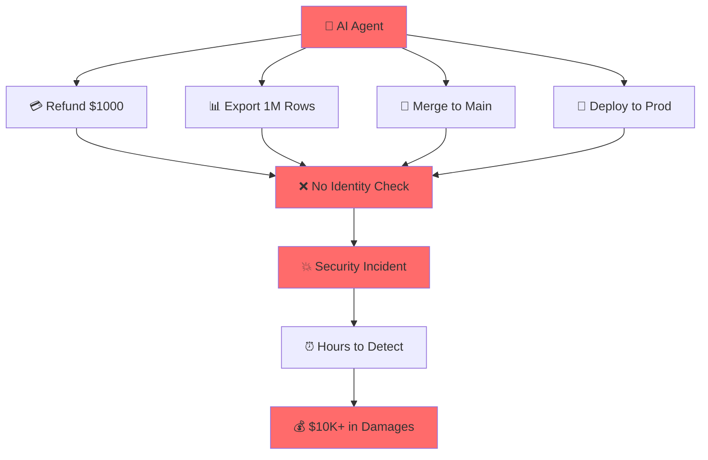
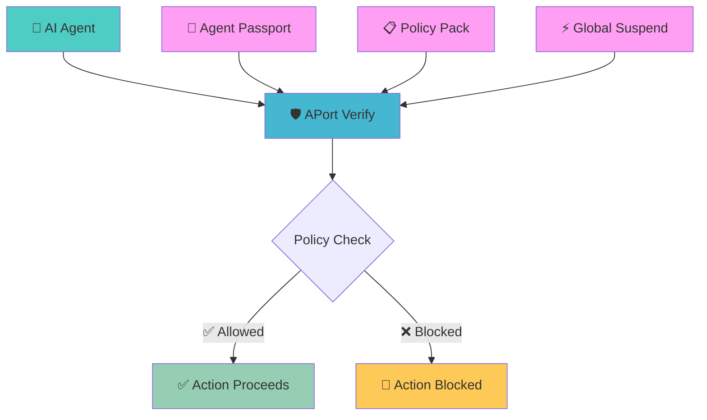
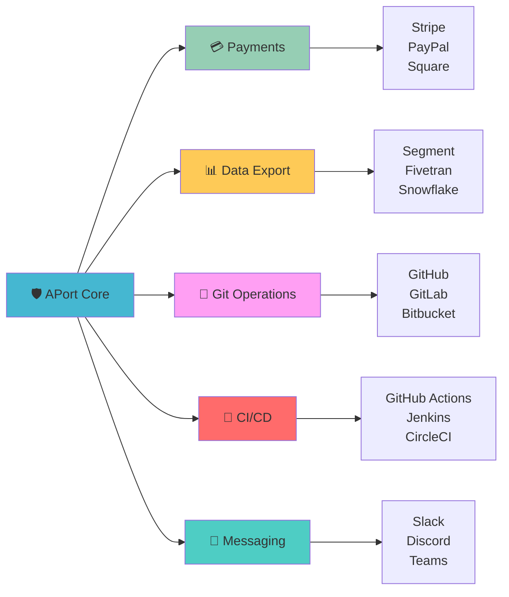
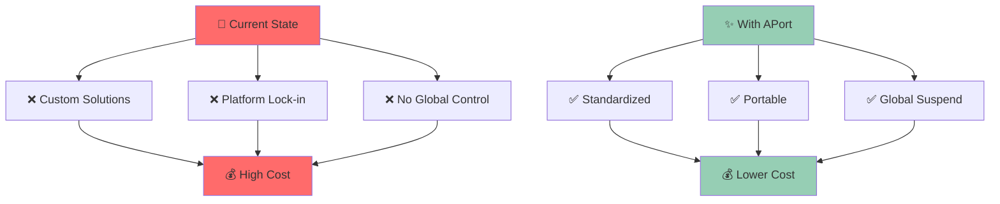

# 🛡️ APort - Agent Identity & Policy Enforcement

<div align="center">


**The neutral, portable passport + verify + suspend rail for AI agents**

[](https://github.com/aporthq/policy-verify-action)
[](https://api.aport.io)
[](LICENSE)
[](https://discord.gg/aport)

[🌐 Website](https://aport.io) • [📚 Docs](https://aport.io/docs) • [🚀 Try Now](https://aport.io/dashboard) • [💬 Community](https://discord.gg/aport)

</div>

---

## 🎯 The Problem

<div align="center">



**Organizations are letting AI agents perform sensitive actions without proper identity verification or policy enforcement.**

</div>

## ✨ The Solution

<div align="center">



**APort provides a neutral, portable identity and policy enforcement layer for AI agents across all platforms.**

</div>

## 🚀 Quick Start

### 1. Create Your Agent Passport

```bash
# Install APort CLI
npm install -g @aport/cli

# Create a new agent
aport create-agent --name "My AI Assistant" --role "Customer Support"
```

### 2. Add Policy Enforcement

```yaml
# .github/workflows/aport-check.yml
name: APort Policy Check
on: [pull_request]

jobs:
  policy-check:
    runs-on: ubuntu-latest
    steps:
      - uses: actions/checkout@v4
      - uses: aporthq/policy-verify-action@v1
        with:
          agent-id: ${{ secrets.APORT_AGENT_ID }}
```

### 3. Integrate with Your App

```javascript
// Node.js Integration
import { verifyPolicy } from '@aport/sdk';

const result = await verifyPolicy({
  agentId: 'agt_123',
  policyPack: 'refunds.v1',
  context: {
    amount: 100,
    currency: 'USD',
    customerId: 'cust_456'
  }
});

if (!result.allowed) {
  throw new Error(`Action blocked: ${result.reason}`);
}
```

## 🎨 Features

<div align="center">

| 🏷️ **Feature** | 📝 **Description** | 🎯 **Use Case** |
|---|---|---|
| **🆔 Agent Identity** | Portable passports with capabilities & limits | Know who your agents are |
| **📋 Policy Packs** | Pre-built policies for common actions | Enforce business rules |
| **⚡ Real-time Verify** | Sub-100ms policy checks | Block bad actions instantly |
| **🚨 Global Suspend** | Kill switch across all platforms | Stop incidents in seconds |
| **🔐 Multi-level Assurance** | Email, GitHub, Domain verification | Trust but verify |
| **📊 Audit Trail** | Complete action history | Compliance & debugging |

</div>

## 🛠️ Supported Platforms

<div align="center">



</div>

## 📦 Policy Packs

### 💳 Refunds Protection
```json
{
  "policy": "refunds.v1",
  "limits": {
    "max_refund_per_tx": 1000,
    "max_refunds_per_day": 10,
    "allowed_currencies": ["USD", "EUR"]
  }
}
```

### 📊 Data Export Control
```json
{
  "policy": "data_export.v1", 
  "limits": {
    "max_rows_per_export": 100000,
    "allow_pii": false,
    "allowed_datasets": ["users", "orders"]
  }
}
```

### 🔀 Repository Safety
```json
{
  "policy": "repo.v1",
  "limits": {
    "max_prs_per_day": 5,
    "allowed_repos": ["owner/repo1"],
    "require_review": true
  }
}
```

## 🎯 Real-World Examples

### 🛒 E-commerce Refund Bot
```javascript
// Before APort
const refund = await stripe.refunds.create({
  amount: 50000, // $500 - no checks!
  payment_intent: paymentIntentId
});

// After APort
const policyCheck = await verifyPolicy({
  agentId: 'refund-bot-001',
  policyPack: 'refunds.v1',
  context: { amount: 50000, currency: 'USD' }
});

if (policyCheck.allowed) {
  const refund = await stripe.refunds.create({
    amount: 50000,
    payment_intent: paymentIntentId
  });
}
```

### 🔀 GitHub PR Automation
```yaml
# .github/workflows/auto-merge.yml
name: Auto Merge
on:
  pull_request:
    types: [opened, synchronize]

jobs:
  check-and-merge:
    runs-on: ubuntu-latest
    steps:
      - uses: actions/checkout@v4
      - uses: aporthq/policy-verify-action@v1
        with:
          agent-id: ${{ secrets.APORT_AGENT_ID }}
          policy-pack: 'repo.v1'
      - name: Auto Merge
        if: success()
        run: gh pr merge --auto
```

## 📊 Performance & Reliability

<div align="center">

| **Metric** | **Target** | **Actual** |
|---|---|---|
| **⚡ Verify Latency** | <100ms p95 | **~50ms p95** |
| **🚨 Suspend Time** | <30s global | **~15s global** |
| **📈 Uptime** | 99.9% | **99.99%** |
| **🔄 Throughput** | 10k req/s | **50k+ req/s** |

</div>

## 🏆 Why Choose APort?

<div align="center">



</div>

### 🎯 **Neutral & Portable**
- Works across all platforms
- No vendor lock-in
- Open standards

### ⚡ **Real-time Enforcement**
- Sub-100ms policy checks
- Global suspend in seconds
- Edge-deployed for speed

### 🔐 **Enterprise Ready**
- Multi-level assurance
- Complete audit trails
- Compliance built-in

### 🛠️ **Developer Friendly**
- Simple APIs
- Rich SDKs
- GitHub Actions ready

## 🚀 Get Started Today

<div align="center">

### 🎯 **For Developers**
[](https://aport.io/dashboard)

### 🏢 **For Platforms**
[](mailto:sales@aport.io)

### 💬 **Join Community**
[](https://discord.gg/aport)

</div>

## 📚 Resources

- 📖 **[Documentation](https://aport.io/docs)** - Complete guides and API reference
- 🎮 **[Playground](https://aport.io/playground)** - Try APort in your browser
- 📺 **[Video Tutorials](https://youtube.com/@aport)** - Step-by-step guides
- 💡 **[Examples](https://github.com/aporthq/examples)** - Real-world implementations
- 🐛 **[Report Issues](https://github.com/aporthq/agent-passport/issues)** - Help us improve

## 🤝 Contributing

We love contributions! Whether it's:

- 🐛 **Bug fixes**
- ✨ **New features** 
- 📚 **Documentation**
- 🎨 **Design improvements**
- 🧪 **Tests**

Check out our [Contributing Guide](CONTRIBUTING.md) to get started.

## 📄 License

This project is licensed under the MIT License - see the [LICENSE](LICENSE) file for details.

---

<div align="center">

**🛡️ Secure your AI agents. Trust but verify.**

[](https://github.com/aporthq)
[](https://twitter.com/aporthq)
[](https://linkedin.com/company/aporthq)

Made with ❤️ by the APort team

</div>
