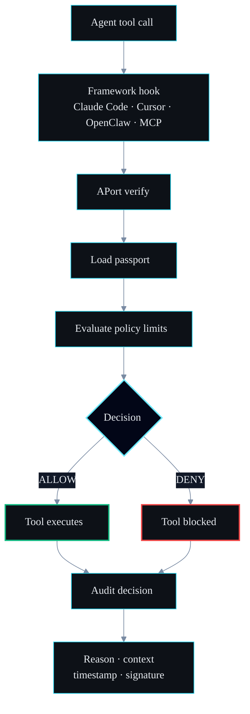
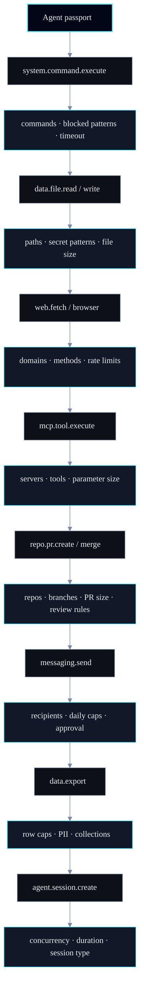

# APort

<div align="center">


**AI agent passport and control plane for agentic work.**

Issue passports, authorize tool calls before execution, and audit what happened.

[Website](https://aport.io) · [Docs](https://aport.io/docs) · [Quickstart](https://aport.io/quickstart) · [Spec](https://github.com/aporthq/aport-spec) · [Contact](mailto:team@aport.io)

</div>

---

## What APort Is

APort is a control plane for AI agents that act through tools. It gives every agent a passport, checks policy before an action runs, and records signed allow/deny decisions for audit.

The core idea is simple:

- **Identity:** who is this agent, who owns it, and what assurance level does it have?
- **Policy:** what capabilities, limits, regions, and contexts are allowed?
- **Guardrails:** should this tool call run right now?
- **Proof:** what was decided, why, when, and for which passport?

APort is built around the [Open Agent Passport (OAP)](https://github.com/aporthq/aport-spec), an open model for agent identity, capabilities, limits, status, and decision records.

## Runtime Flow


```mermaid
%%{init: {"theme": "base", "themeVariables": {"background": "#06090f", "primaryColor": "#0d1117", "primaryTextColor": "#e8ecf1", "primaryBorderColor": "#22d3ee", "lineColor": "#7a8ba3", "secondaryColor": "#111827", "tertiaryColor": "#020617", "fontFamily": "Inter, ui-sans-serif, system-ui"}}}%%
flowchart TB
    A["Agent tool call"]
    A --> B["Framework hook<br/>Claude Code · Cursor · OpenClaw · MCP"]
    B --> C["APort verify"]
    C --> D["Load passport"]
    D --> E["Evaluate policy limits"]
    E --> F{"Decision"}
    F -->|"ALLOW"| G["Tool executes"]
    F -->|"DENY"| H["Tool blocked"]
    G --> I["Audit decision"]
    H --> I
    I --> J["Reason · context<br/>timestamp · signature"]

    classDef node fill:#0d1117,color:#e8ecf1,stroke:#22d3ee,stroke-width:1px;
    classDef decision fill:#020617,color:#e8ecf1,stroke:#67e8f9,stroke-width:2px;
    classDef allow fill:#0d1117,color:#e8ecf1,stroke:#10b981,stroke-width:2px;
    classDef deny fill:#0d1117,color:#e8ecf1,stroke:#ef4444,stroke-width:2px;
    class A,B,C,D,E,I,J node;
    class F decision;
    class G allow;
    class H deny;
```

APort runs at the tool boundary. It is not a prompt, policy reminder, or post-hoc log parser. If the passport does not authorize the action, the action does not run.

## Install In 60 Seconds

Claude Code:

```bash
curl -fsSL https://aport.io/install.sh | bash -s -- claude-code
```

Or use the npm package directly:

```bash
npx --yes @aporthq/aport-agent-guardrails claude-code
```

Non-interactive hosted setup:

```bash
npx --yes @aporthq/aport-agent-guardrails claude-code \
  --quick-hosted \
  --email you@example.com \
  --non-interactive
```

The installer can create a hosted passport, create a narrow passport-bound setup key, write the framework hook/config, and start sending decisions to APort.

## Supported Frameworks

| Framework | Enforcement Surface | Setup |
|---|---|---|
| Claude Code | `PreToolUse` hook for Bash, Read, Write, Edit, Web, MCP, Task, and more | `npx @aporthq/aport-agent-guardrails claude-code` |
| Cursor | Shell/tool hooks for file, shell, web, MCP, and agent actions | `npx @aporthq/aport-agent-guardrails cursor` |
| OpenClaw | Plugin-level `before_tool_call` enforcement | `npx @aporthq/aport-agent-guardrails openclaw` |
| LangChain | Callback/provider integration | `npx @aporthq/aport-agent-guardrails langchain` |
| CrewAI | Released compatibility adapter and native-provider path | `npx @aporthq/aport-agent-guardrails crewai` |
| DeerFlow | Generic OAP provider setup | `npx @aporthq/aport-agent-guardrails deerflow` |
| n8n | Config and API-first guardrail path | `npx @aporthq/aport-agent-guardrails n8n` |
| Custom agents | Direct verify API or OAP provider | `POST /api/verify/policy/{pack_id}` |

## What Gets Checked


```mermaid
%%{init: {"theme": "base", "themeVariables": {"background": "#06090f", "primaryColor": "#0d1117", "primaryTextColor": "#e8ecf1", "primaryBorderColor": "#22d3ee", "lineColor": "#7a8ba3", "secondaryColor": "#111827", "tertiaryColor": "#020617", "fontFamily": "Inter, ui-sans-serif, system-ui"}}}%%
flowchart TB
    P["Agent passport"]
    P --> C1["system.command.execute"]
    C1 --> L1["commands · blocked patterns · timeout"]
    L1 --> C2["data.file.read / write"]
    C2 --> L2["paths · secret patterns · file size"]
    L2 --> C3["web.fetch / browser"]
    C3 --> L3["domains · methods · rate limits"]
    L3 --> C4["mcp.tool.execute"]
    C4 --> L4["servers · tools · parameter size"]
    L4 --> C5["repo.pr.create / merge"]
    C5 --> L5["repos · branches · PR size · review rules"]
    L5 --> C6["messaging.send"]
    C6 --> L6["recipients · daily caps · approval"]
    L6 --> C7["data.export"]
    C7 --> L7["row caps · PII · collections"]
    L7 --> C8["agent.session.create"]
    C8 --> L8["concurrency · duration · session type"]

    classDef root fill:#020617,color:#e8ecf1,stroke:#67e8f9,stroke-width:2px;
    classDef node fill:#0d1117,color:#e8ecf1,stroke:#7a8ba3,stroke-width:1px;
    classDef leaf fill:#111827,color:#e8ecf1,stroke:#22d3ee,stroke-width:1px;
    class P root;
    class C1,C2,C3,C4,C5,C6,C7,C8 node;
    class L1,L2,L3,L4,L5,L6,L7,L8 leaf;
```

Defaults are intentionally developer-friendly, but sensitive operations still have hard stops. For example, sensitive file reads such as `.env*`, `.aws/*`, `.ssh/*`, and `*credentials*` can be blocked by default while teams tune exact policies for their environment.

## Core Repositories

| Repository | Purpose |
|---|---|
| [aport-agent-guardrails](https://github.com/aporthq/aport-agent-guardrails) | One-command guardrail installers, local evaluator, framework hooks, enterprise scripts |
| [aport-spec](https://github.com/aporthq/aport-spec) | Open Agent Passport schemas and decision format |
| [agent-passport](https://github.com/aporthq/agent-passport) | APort dashboard, APIs, hosted verification, org/team workflows |
| [aport-skills](https://github.com/aporthq/aport-skills) | Agent skills and setup helpers |
| [policy-verify-action](https://github.com/aporthq/policy-verify-action) | GitHub Action for CI policy verification |

## Hosted And Local Modes

APort supports both hosted and local enforcement:

| Mode | Best For | Behavior |
|---|---|---|
| Hosted API | Teams, pilots, audit trails, dashboards, org controls | Calls APort verify API, records decisions, supports suspend/kill switch |
| Local | Offline development, privacy-sensitive trials, CI fixtures | Evaluates against local passport JSON and writes local decision/audit files |

Hosted mode is fail-closed by default. If the API cannot be reached, sensitive tool calls are denied rather than silently downgraded.

## Enterprise Controls

APort is designed for teams that need more than a prompt-level rule:

- **Organization context:** team-owned passports, scoped setup keys, member roles, and org-wide audit.
- **Multi-tenant issuance:** template passports can mint instance passports for devices, users, tenants, or customer installs.
- **Data residency:** passport, policy, and audit data can be routed by tenant and region.
- **Kill switch:** suspend a passport and stop future tool authorization.
- **Evidence:** decisions include policy id, allow/deny result, reasons, timestamps, assurance level, and integrity metadata.
- **Enterprise deployment:** self-contained device deployment, enforcement, and uninstall scripts for IT-managed fleets.

## Why This Exists

Agentic systems are moving from chat into execution: shell commands, file edits, browser actions, MCP tools, repo operations, exports, messages, and payments. Traditional controls do not map cleanly:

- Prompts are advisory.
- Output filters run after the model has already planned the action.
- Sandboxes contain blast radius but do not answer whether the action was authorized.
- Generic API keys identify software, not the agent passport, owner, limits, and reason for a specific action.

APort fills the missing layer: **pre-action authorization for agent tools**.

## Links

- Website: [aport.io](https://aport.io)
- Quickstart: [aport.io/quickstart](https://aport.io/quickstart)
- Framework docs: [aport.io/frameworks](https://aport.io/frameworks)
- Blog: [aport.io/blog](https://aport.io/blog)
- OAP spec: [github.com/aporthq/aport-spec](https://github.com/aporthq/aport-spec)
- Support: [support@aport.io](mailto:support@aport.io)

---

<div align="center">

**Passports for agents. Policy before tools. Proof after every decision.**

</div>
